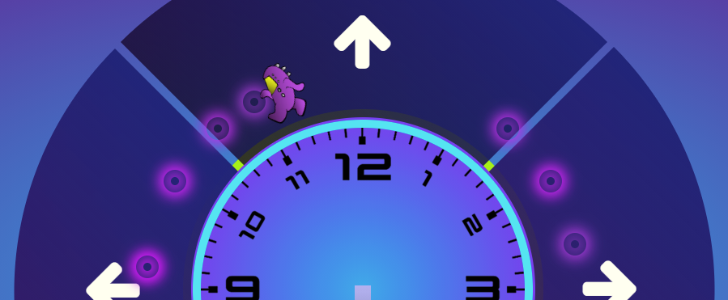

# Time Bomber

Simple multiplayer game where players set the time on their respective clock, then players attempt to win the game by dropping items on each other's timelines.

## The Challenge

Create a multi-player game that utilizes sockets for real-time player drops. Each player is unaware of where the other player is and attempts to blindly drop bombs in an effort to defeat their opponent. Players also compete for random-bonus drops that boost health of increase speed.

### CHALLENGE ACCEPTED!

https://time-bomber.herokuapp.com/game

### Technology & Tools

      

### Future Plans

- animate clock hands when game begins
- allow user to manually adjust clock hands
- remove blue bombs from visibility (only for testing)
- allow for up to 4 players to join the fight
